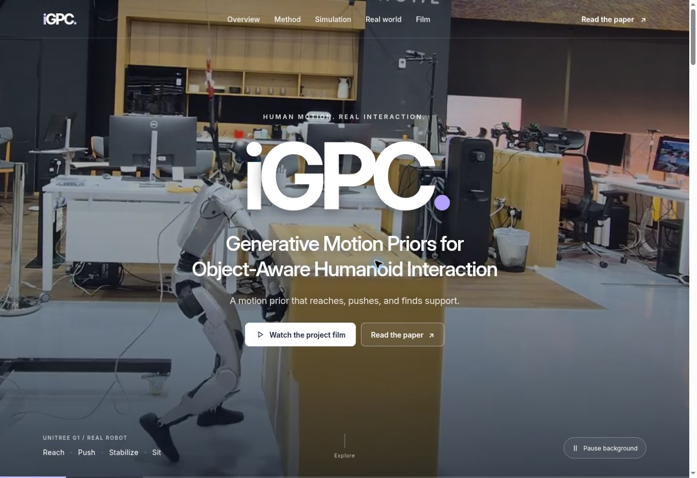

# iGPC project website

**iGPC: Generative Motion Priors for Object-Aware Humanoid Interaction**

A responsive research project page with a cinematic real-robot video backdrop and iGPC title overlay, animated section entrances, separate simulation and real-world galleries, an expandable method figure, the full project film, and manuscript PDF. The supplied paper is an anonymous ICRA 2027 submission; no author names or acceptance claims have been added.



## Publish

In **Settings → Pages**, set **Source** to **GitHub Actions**. The included **Build and publish project website** workflow publishes the complete site whenever `main` changes. You can also run it manually from the **Actions** tab.

Live site: https://anujithm.github.io/iGPC.github.io/

Use **GitHub Actions** as the Pages source for the verified build. The workflow also stores the complete video/PDF assets in the repository, supporting direct static previews.

## Preview locally

```bash
python3 scripts/build.py
python3 -m http.server 8080 --directory dist
```

Open `http://localhost:8080`. No package installation is required.

## Content

- `index.html` — research copy, metrics, and section structure
- `styles.css` — responsive design
- `script.js` — chapter selection, media behavior, figure dialog
- `assets/` — figures, posters, fonts, and small media
- `.media/` — transfer parts for larger video/PDF files
- `scripts/build.py` — assembles media and verifies SHA-256 integrity

Larger media is split only for reliable repository transfer. The build reconstructs ordinary MP4 and PDF files, verifies their hashes, and commits complete assets back to the repository so direct hosting also has playable videos. Visitors receive standard files with native browser playback. Update the transfer parts and manifest when replacing an assembled asset.

Numerical results are explicitly labeled as simulation; real-robot clips are qualitative demonstrations. The box benchmark retains each method's native simulator and control interface. All project figures, videos, and research claims come from the supplied iGPC materials. The page design is original, informed by the requested ADAPT, FADA, and Perceptive BFM references.

The existing MIT license is preserved. Inter is distributed under its included SIL Open Font License.
